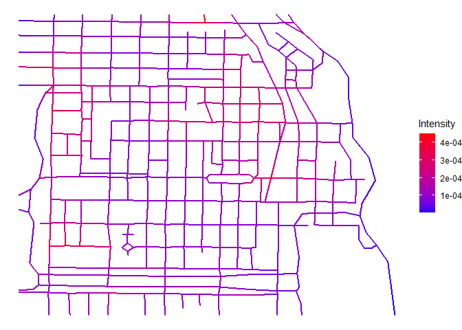

# geonet

<!-- badges: start -->
<!-- badges: end -->

The goal of geonet is to provide a tool for the estimation of the
intensity function of a spatial point process on a geometric network. It
makes use of generalized additive model (GAM) theory and has a similar
workaround. In comparison to other methods, it allows to include
external and internal covariates in the model, see the example below.

## Installation

You can install the released version of geonet from
[CRAN](https://CRAN.R-project.org) with:

``` r
install.packages("geonet")
```

And the development version from [GitHub](https://github.com/) with:

``` r
# install.packages("devtools")
devtools::install_github("MarcSchneble/geonet")
```

## Example

This is a basic example which shows you how to solve a common problem:

``` r
library(geonet)
library(spatstat.data)

X <- as_gnpp(chicago)
delta <- 10
h <- 2
r <- 2
formula <- X ~ marks + internal(x) + internal(y)

model <- intensity_pspline(formula, X, delta = delta, h = h, r = r,
                           scale = list(x = 1/1000, y = 1/1000))
summary(model)
#> Poisson model on a geometric network fitted with maximum likelihood.
#> 
#> Formula:
#> ~marks + internal(x) + internal(y)
#> <environment: 0x0000000019fb3698>
#> 
#> Parametric coefficients:
#>               Estimate Std. Error z value Pr(>|z|)   
#> marksburglary -1.38629    0.50000 -2.7726 0.005561 **
#> markscartheft -1.04982    0.43916 -2.3906 0.016823 * 
#> marksdamage    0.55962    0.28031  1.9964 0.045885 * 
#> marksrobbery  -1.60944    0.54772 -2.9384 0.003299 **
#> markstheft     0.64185    0.27625  2.3234 0.020156 * 
#> markstrespass -1.20397    0.46547 -2.5865 0.009694 **
#> x              0.11226    1.05453  0.1065 0.915219   
#> y              1.78083    1.11276  1.6004 0.109516   
#> ---
#> Signif. codes:  0 '***' 0.001 '**' 0.01 '*' 0.05 '.' 0.1 ' ' 1
#> 
#> Number of Fellner-Schall-iterations: 16
plot(model)
```


